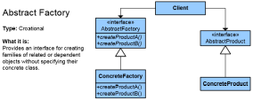

# Шаблони за дизайн домашно
## Абстрактна Фабрика
Абстрактна фабрика е създаващ шаблон за дизайн, който се използва в обектно-ориентираното програмиране.
Фабриката е средство за създаване на обекти. Целта на този шаблон за дизайн е да изолира създаването на обектите от тяхното използване.



Абстрактната фабрика капсулира група от методи Фабрика имащи близко предназначение. Клиентският код създава конкретна имплементация на абстрактната фабрика, след това използва основния интерфейс за да създава конкренти обекти. Клиентът не е задължен да знае коя от тези фабрики е създала конкретния обект, защото той използва само основния интерфейс към създадените обекти.
Този шаблон позволява замяната на конкретни класове, дори по време на изпълнение, без да е нужна промяна на кода, който ги използва. Това обаче е за сметка на на допълнително усложняване на кода, което не е много желателно.
###Пример:
```C#
abstract class GUIFactory {
     public static GUIFactory getFactory() {
         int sys = readFromConfigFile("OS_TYPE");
         if (sys==0) {
             return(new WinFactory());
         } else {
             return(new OSXFactory());
         }
    }
    public abstract Button createButton();
 }
 
 class WinFactory:GUIFactory {
     public override Button createButton() {
         return(new WinButton());
     }
 }
 
 class OSXFactory:GUIFactory {
     public override Button createButton() {
         return(new OSXButton());
     }
 }
 
 abstract class Button  {
     public string caption;
     public abstract void paint();
 }
 
 class WinButton:Button {
     public override void paint() {
        Console.WriteLine("I'm a WinButton: "+caption);
     }
 }
 
 class OSXButton:Button {
     public override void paint() {
        Console.WriteLine("I'm a OSXButton: "+caption);
     }
 }
 
 class Application {
     static void Main(string[] args) {
         GUIFactory aFactory = GUIFactory.getFactory();
         Button aButton = aFactory.createButton();
         aButton.caption = "Play";
         aButton.paint();
     }
     //output is: I'm a WinButton: Play, or: I'm a OSXButton: Play
 }
 ```

## Сек (шаблон)
Сек (Singleton) е създаващ шаблон за дизайн, който се използва в обектно-ориентираното програмиране. Този шаблон се използва обикновено в моделирането на обекти, които трябва да бъдат глобално достъпни за обектите на приложението (например обекта съдържащ структурите с настройките на програмата) или обекти, които се нуждаят от максимално късна инициализация за пестенето на ресурси от паметта. В софтуерното инженерство Сек шаблонът е дизайн шаблон, който представя ограничението на клас до един обект. Това е полезно, когато точно един обект се нуждае да координира действия през системата. Концепцията понякога се отнася за системи, които работят по-ефективно, когато съществува само един обект или когато е ограничено представянето на определен брой обекти. Терминът идва  от математическата концепция за Сек. Има критики откъм използването на Сек, като някои го смятат за анти-модел. Съди се, че е преизползван  и въвежда  ненужни ограничения в ситуации, където например  класа не е наистина необходим и въвежда глобално условни в апликацията.


```C#
// Пример за Сек
using System;

namespace SingletonDesignPattern
{
  /// <summary>
  /// Главен клас за стартиране на примерното приложение
  /// </summary>
  class MainApp
  {
    /// <summary>
    /// Главен метод за стартиране
    /// </summary>
    static void Main()
    {

      // Конструкторът е защитен -- операторът new не може да бъде извикан
      Singleton s1 = Singleton.Instance();
      Singleton s2 = Singleton.Instance();

      // Проверка за идентичност на инстанцията
      if (s1 == s2)
      {
        Console.WriteLine("Objects are the same instance"); //и двата обекта са една и съща инстанция на този клас
      }
      // Изчакай удар по конзолата от Котребителя
      Console.ReadKey();
    }
  }

  /// <summary>
  /// The 'Singleton' class – класът Сек
  /// </summary>
  class Singleton
  {
    private static Singleton _instance;  //променлива за единствената инстанция на този клас
    // Конструторът е защитен и не може да бъде извикан
    protected Singleton()
    {

    }

    // Единтвеният начин за инстанцииране е от тук
    public static Singleton Instance()
    {
      // Използва късна инициализация (lazy initialization)
      // N.B.: Да не се използва в многонишкови приложения
      if (_instance == null)
      {
        _instance = new Singleton();
      }
      return _instance;
    }
  }
}
```