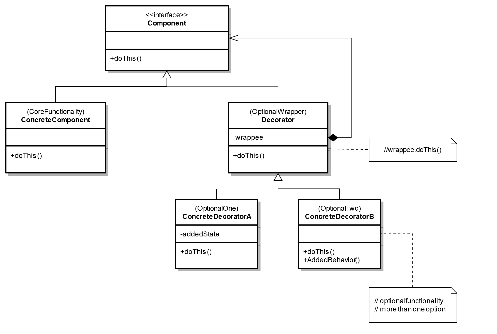
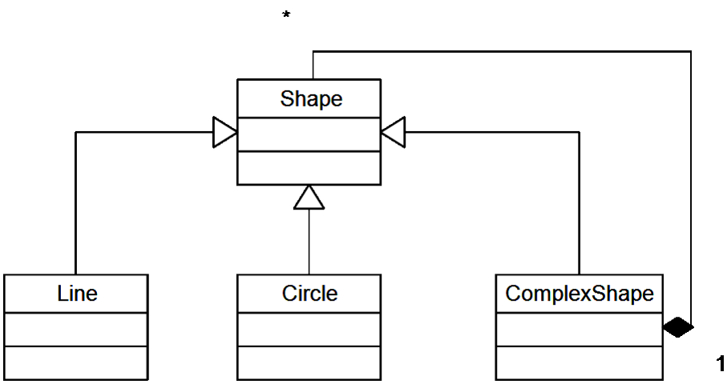
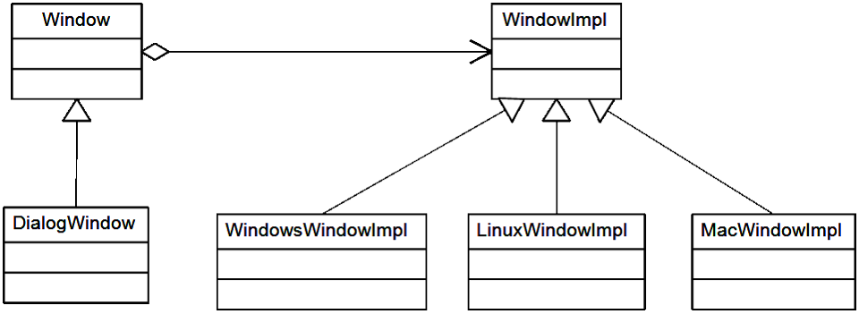

# Шаблони за дизайн: структурни шаблони
## Декоратор (шаблон)
Този вид шаблон може да се използва за добавяне на функционалност към определен обект динамично, без това да засяга другите инстанции на същия клас. Това се постига чрез създаването на нов клас Декоратор(англ. wrapper-опаковка), който „обвива“ класа. Това лесно може да се представи с примера, “опаковане на подарък, слагане на подаръка в кутия, опаковане на кутията“. Създава се поредица от обекти, която започва с декоратор обектите, отговорни за новите функционалности, и завършва с оригиналния обект.



###Пример:
```C#
using System;
using System.Collections.Generic;
using System.Text;


class DecoratorPatterns
{

	// Decorator Pattern   програмен шаблон за Декоратор - автор Judith Bishop  Dec 2006
	// Показва 2 декоратора и изводът от различни компбинации
	// на декоратори върху основния компонент


	interface IComponent
	{
		string Operation ();
	}

	class Component : IComponent
	{
		public string Operation ()
		{
			return "I am walking "; //Аз вървя
		}
	}

	class DecoratorA : IComponent
	{
		IComponent component;

		public DecoratorA ( IComponent c )
		{
			component = c;
		}

		public string Operation ()
		{
			string s = component.Operation ();
			s += "and listening to Classic FM "; //и слушам радио Классик
			return s;
		}
	}

	class DecoratorB : IComponent
	{
		IComponent component;
		public string addedState = "past the Coffee Shop "; //вече съм минал покрай кафето


		public DecoratorB ( IComponent c )
		{
			component = c;
		}

		public string Operation ()
		{
			string s = component.Operation ();
			s += "to school "; //към училище
			return s;
		}

		public string AddedBehavior () //прибавено поведение
		{
			return "and I bought a cappuccino "; //и си купих капучино
		}
	} //eof class

	class Client
	{

		static void Display ( string s, IComponent c )
		{

			Console.WriteLine ( s + c.Operation () );
		} //eof method


		static void Main ()
		{
			Console.WriteLine ( "Decorator Pattern\n" );

			IComponent component = new Component ();
			Display ( "1. Basic component: ", component );
			Display ( "2. A-decorated : ", new DecoratorA ( component ) );
			Console.ReadLine (); //изчакай удар по конзолата от потребителя
			Display ( "3. B-decorated : ", new DecoratorB ( component ) );
			Console.ReadLine ();
			Display ( "4. B-A-decorated : ", new DecoratorB ( new DecoratorA ( component ) ) );
			// Explicit DecoratorB
			Console.ReadLine ();
			DecoratorB b = new DecoratorB ( new Component () );
			Display ( "5. A-B-decorated : ", new DecoratorA ( b ) );
			// Invoking its added state and added behavior
			Console.WriteLine ( "\t\t\t" + b.addedState + b.AddedBehavior () );
			Console.ReadLine ();
		} //eof Main
	} //eof class Client
} //eof class DecoratorPatterns
/* Output --- изводът на информация по конзолният прозорец
Decorator Pattern

1. Basic component: I am walking
2. A-decorated : I am walking and listening to Classic FM -
3. B-decorated : I am walking to school
4. B-A-decorated : I am walking and listening to Classic FM to school
5. A-B-decorated : I am walking to school and listening to Classic FM
				 past the Coffee Shop and I bought a cappuccino
*/
```

## Композиция
Шаблонът композиция позволява да се обединяват различни типове обекти в дървовидни структури. Той дава възможност да се третират еднакво отделни обекти или групи от обекти.

Прилага се когато:
* При работата с различни обекти искате да игнорирате разликите между тях и да ги третирате еднакво
* Искате да представите йерархия от съставни обекти



### Пример:
```C#
abstract class Shape
{
    public abstract void Draw();
}

class Line: Shape
{
    public override void Draw()
    {
        Console.WriteLine("Line.Draw()");
    }
}

class Circle: Shape
{
    public override void Draw()
    {
        Console.WriteLine("Circle.Draw()");
    }
}

class ComplexShape: Shape
{
    private ArrayList mOwnedShapes;
    public ComplexShape()
    {
        mOwnedShapes = new ArrayList();
    }
    public override void Draw()
    {
        foreach (Shape shape in mOwnedShapes)
        {
            shape.Draw();
        }
    }
        public void AddShape(Shape shape)
    {
        mOwnedShapes.Add(shape);
    }
} //ComplexShape

static void Main(string[] args)
{
    ComplexShape rootShape = new ComplexShape();

    Line firstLine = new Line();
    rootShape.AddShape(firstLine);

    Circle firstCircle = new Circle();
    rootShape.AddShape(firstCircle);

    ComplexShape complexShape = new ComplexShape();

    Line secondLine = new Line();
    complexShape.AddShape(secondLine);
    
    Circle secondCircle = new Circle();
    complexShape.AddShape(secondCircle);

    Circle thirdCircle = new Circle();
    complexShape.AddShape(thirdCircle);

    rootShape.AddShape(complexShape);

    rootShape.Draw();
} //Main

/*Резултат:
Line.Draw()
Circle.Draw()
Line.Draw()
Circle.Draw()
Circle.Draw()*/
```

## Мост
Мост (на английски: Bridge) е структурен шаблон за дизайн, който се използва в обектно-ориентираното програмиране. Използва се за да “раздели абстракция от нейната имплементация, така че двете да могат да се променят независимо”. Предоставя решение на проблеми, които обикновенно се решават чрез наследяване.



Предимства:
* Разделяне на интерфейса от имплементацията
* Подобряване на възможностите за разширяване

###Пример:
```C#
public class Window
{
    public Window()
    {
        concreteWindow = ImplFactory.GetWindowImpl();
    }

    private WindowImpl concreteWindow;

    public void Draw()
    {
        concreteWindow.Draw();
    }
}

public abstract class WindowImpl
{
    public abstract void Draw();
}

public class DialogWindow: Window
{
    public void DrawDialogWindow()
    {
        base.Draw();
        Console.WriteLine("Execute dialog window 
            specific logic");
    }
}

public class WindowsWindowImpl: WindowImpl
{
    public override void Draw()
    {
        Console.WriteLine("Windows - Draw");
    }
}

public class LinuxWindowImpl: WindowImpl
{
    public override void Draw()
    {
        Console.WriteLine("Linux - Draw");
    }
}

public class ImplFactory
{
    public static WindowImpl GetWindowImpl()
    {
        //Read app settings and return concrete
        //WindowImpl object

        return new LinuxWindowImpl();
    }
}

class Program
{
    static void Main(string[] args)
    {
        Console.WriteLine("Use window");
        Window newWindow = new Window();
        newWindow.Draw(); 
        Console.WriteLine();
        Console.WriteLine("Use DialogWindow");
        DialogWindow newDialogWIndow = 
           new DialogWindow();
        newDialogWIndow.DrawDialogWindow();
    }
}
```

Резултат:

Use window

Linux - Draw

Use DialogWindow

Linux - Draw

Execute dialog window specific logic