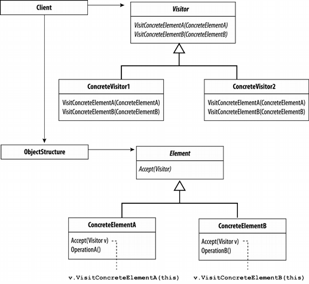

# Шаблони за дизайн: поведенчески шаблони
## Стратегия
Стратегия (на английски: Strategy) е поведенчески шаблон за дизайн, който се използва в обектно-ориентираното програмиране.

Шаблонът Стратегия се използва в случаите, когато е необходим динамичен избор на алгоритъм. Дефинира се семейство от различни, но взаемозаменяеми алгоритми, всеки един от тях капсулиран като отделен обект. Стратегията позволява превключването от един към друг алгоритъм да става независимо от клиентския код който ги използва.


### Поведение
Съгласно шаблона Стратегия, поведението на конкретен клас не бива да се наследява. Вместо това трябва да се използва интерфейс, който дефинира външния вид на класовете които ще го наследяват и ще бъдат имплементирани.

### Пример:
```C#
using System;
 
namespace Wikipedia.Patterns.Strategy
{
  // MainApp test application
  class MainApp
  {
    static void Main()
    {
      Context anObject;
 
      // Three contexts following different strategies
      anObject= new Context(new ConcreteStrategyA());
      anObject.Execute();
 
      anObject.UpdateContext(new ConcreteStrategyB());
      anObject.Execute();
 
      anObject.UpdateContext(new ConcreteStrategyC());
      anObject.Execute();
 
    }
  }
 
  // The classes that implement a concrete strategy must implement this Execute function.
  // The context class uses this to call the concrete strategy
  interface IStrategy
  {
    void Execute();
  }
 
  // Implements the algorithm using the strategy interface
  class ConcreteStrategyA : IStrategy
  {
    public void Execute()
    {
      Console.WriteLine( "Called ConcreteStrategyA.Execute()" );
    }
  }
 
  class ConcreteStrategyB : IStrategy
  {
    public void Execute()
    {
      Console.WriteLine( "Called ConcreteStrategyB.Execute()" );
    }
  }
 


  class ConcreteStrategyC : IStrategy
  {
    public void Execute()
    {
      Console.WriteLine( "Called ConcreteStrategyC.Execute()" );
    }
  }
 
  // Configured with a ConcreteStrategy object and maintains a reference to a Strategy object
  class Context
  {
    IStrategy strategy;
 
    // Constructor
    public Context(IStrategy strategy)
    {
      this.strategy = strategy;
    }
 
    public void UpdateContext(IStrategy strategy)
    {
      this.strategy = strategy;
    }
 
    public void Execute()
    {
      strategy.Execute();
    }
  }
}
 ```
 
 ## Итератор (шаблон)
 Итератор (на английски: Iterator) е поведенчески шаблон за дизайн, който се използва в обектно-ориентираното програмиране. Итератора предоставя начин за последователен достъп до елементите на обект, без да е нужна вътрешна информация за обекта.В компютърно програмиране, итератор е обект, който дава възможност на програмиста да преминава през структура от данни. Различни видове итератори често са предоставяни чрез интерфейс контейнер. Въпреки, че интерфейса и семантиката на даден итератор са фиксирани, итераторите често се прилагат по отношение на свързаните с тях структури за изпълнение и често са плътно свързани към контейнера, за да отговарят на семантиката на Итератора. Имайте предвид, че итераторът чете и също така дава достъп до елементите в една структура от данни, но не изпълнява итерация ( при тривиално използване на терминологията). Итераторът поведенчески е подобен на курсора на база данни.
 ## Пример
 Итераторите обикновено се използват, чрез извикване на метода GetEnumerator () на обекта за изпълнение на IEnumerable интерфейса. Класове-контейнери обикновено въвеждат този интерфейс, въпреки това foreach твърдението в C# може да работи с всеки обект, който предоставя такъв метод, дори ако той не се изпълни от IEnumerable.
Следните примери показва използването на итератори в C #:
```C#
// explicit version
IEnumerator<MyType> iter = list.GetEnumerator();
while (iter.MoveNext())
    Console.WriteLine(iter.Current);
 
// implicit version
foreach (MyType value in list)
    Console.WriteLine(value);
```

## Посетител (шаблон)
В обектно-ориентираното програмиране и софтуерно инжинерство, дизайнерският шаблон, наречен "посетител", представлява метод за отделяне на даден алгоритъм от обектната структура, върху която оперира. Практическата полза от подобно отделяне идва от възможността да се добавят нови свойства и операции към съществуващи вече структури без да се налага модификация. Заради свойствата си посетителският модел е един от начините да се следва отворено/затворения принцип.

По същество, посетителят дава възможност на потребител да добавя виртуални функции на семейство класове без да ги променя. За целта  се създава посетителски клас, който имплементира всички, подходящи специализации на виртуалната функция. Посетителят приема за входящи данни референция на класа и постига желания резултат, чрез така нареченото двойно изпращане.



### Пример:
```C#
// Visitor pattern -- Structural example 

using System;
using System.Collections;


// "Visitor" 

abstract class Visitor
{
	public abstract void VisitConcreteElementA(
		ConcreteElementA concreteElementA);

	public abstract void VisitConcreteElementB(
		ConcreteElementB concreteElementB);
}

// "ConcreteVisitor1" 

class ConcreteVisitor1 : Visitor
{
	public override void VisitConcreteElementA(
		ConcreteElementA concreteElementA)
	{
		Console.WriteLine("{0} visited by {1}",
		concreteElementA.GetType().Name, 			this.GetType().Name);
    	}

	public override void VisitConcreteElementB(
		ConcreteElementB concreteElementB)
	{
		Console.WriteLine("{0} visited by {1}",
			concreteElementB.GetType().Name, 		this.GetType().Name);
	}
}

// "ConcreteVisitor2" 

class ConcreteVisitor2 : Visitor
{
	public override void VisitConcreteElementA(
		ConcreteElementA concreteElementA)
	{
		Console.WriteLine("{0} visited by {1}",
			concreteElementA.GetType().Name, 			this.GetType().Name);
	}

	public override void VisitConcreteElementB(
		ConcreteElementB concreteElementB)
	{
		Console.WriteLine("{0} visited by {1}",
			concreteElementB.GetType().Name, 			this.GetType().Name);
	}
}

// "Element" 

abstract class Element
{
	public abstract void Accept(Visitor visitor);
}

// "ConcreteElementA" 

class ConcreteElementA : Element
{
	public override void Accept(Visitor visitor)
	{
		visitor.VisitConcreteElementA(this);
	}

	public void OperationA()
	{
	}
}

// "ConcreteElementB" 

class ConcreteElementB : Element
{
	public override void Accept(Visitor visitor)
	{
		visitor.VisitConcreteElementB(this);
	}

	public void OperationB()
	{
	}
}

// "ObjectStructure" 
class ObjectStructure
{
	private ArrayList elements = new ArrayList();
	public void Attach(Element element)
	{
		elements.Add(element);
	}
	public void Detach(Element element)
	{
		elements.Remove(element);
	}
	public void Accept(Visitor visitor)
	{
		foreach (Element e in elements)
		{
			e.Accept(visitor);
		}
	}
}

class MainApplication
{
   static void Main()
   {
   // Setup structure 
   ObjectStructure structure = new ObjectStructure();
   structure.Attach(new ConcreteElementA());
   structure.Attach(new ConcreteElementB());

   // Create visitor objects 
   ConcreteVisitor1 v1 = new ConcreteVisitor1();
   ConcreteVisitor2 v2 = new ConcreteVisitor2();

   // Structure accepting visitors 
   structure.Accept(v1);
   structure.Accept(v2);

   // Wait for user 
   Console.Read();
}
